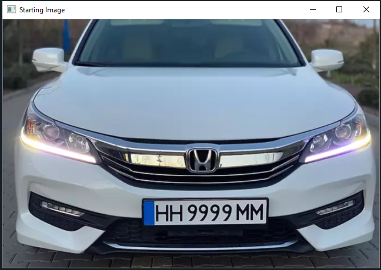

## License_plate_scanner
A program that processes images of vehicles, locates the license plate in the image, reads it, and then outputs it in text form.

## Python Requirements
- This was tested using [Python 3.8](https://www.python.org/downloads/release/python-380/)
Feel free to try and use the latest version of Python (3.9). At the time of writing this, only tested with Python 3.8

- Might need to uninstall all other versions of python to be able to follow the instructions.

- [Download Git](https://git-scm.com/downloads)
  - If you don't have it already
  - To clone and push to the repo

## Cloning the repository
- Open CMD/Powershell/Terminal
  - CD into the directory of your choice (we'll be using desktop)\

  ``` cd desktop ```
  - Clone this repo

  ``` git clone https://github.com/johnsuico/license-plate-reader.git ```

## Installing pip packages
- Install numpy

  ``` pip install numpy ```

- Install OpenCV

  ``` pip install opencv-python ```
- Download and install PyTesseract
  - Refer to the pyteseract documentation for installation since it seems like different people install it differently
  - [pytesseract](https://pypi.org/project/pytesseract/)
  
- Install pandas

  ` pip install pandas `
  
## Running the program
- cd into where you placed the repository using CMD, PoweShell, or Terminal
- Type `py main.py`
- Follow the instructions on the screen

## Demo/Steps
- Step 1, Starting image
- 
- Step 2, Gaussian blur the image
- 
- Step 3, Grayscale the blurred image
- 
- Step 4, Detect the plate using contour extraction
- 
- Step 5, Crop the image of the plate and resize it, we can discard the rest of the image as we are just concerned with the plate
- 
- Step 6, Grayscale the image of the plate
- 
- Step 7, Gaussian blur the plate
- 
- Step 8, Read the license plate and output the text
- 

